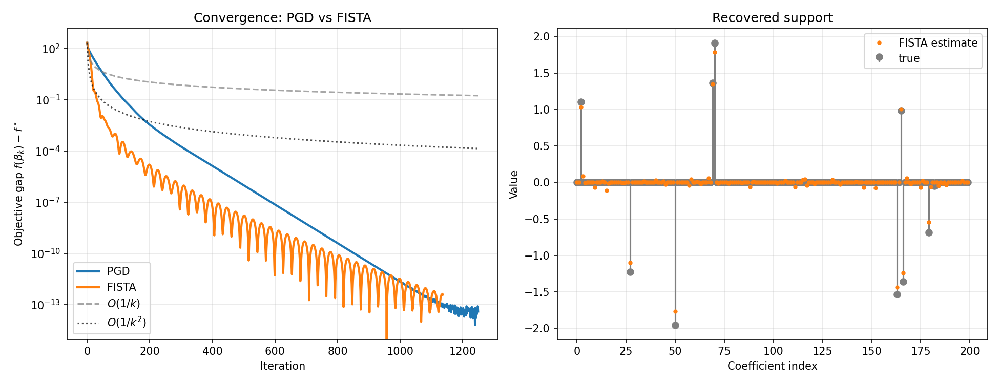

# L1BallPGD

[](https://github.com/marouanedaoudi/L1BallPGD/actions/workflows/ci.yml)
[](https://www.python.org/)
[](https://github.com/astral-sh/ruff)
[](https://mypy-lang.org/)
[](LICENSE)

First-order solvers for the **L1-constrained least-squares problem** (the constrained Lasso),

$$
\min_{\beta \in \mathbb{R}^p}\ \tfrac{1}{2}\,\lVert y - X\beta \rVert_2^2
\quad \text{s.t.}\quad \lVert \beta \rVert_1 \le t ,
$$

built around an exact $O(p\log p)$ Euclidean projection onto the $\ell_1$ ball.
The package ships two solvers — vanilla **Projected Gradient Descent (PGD)** and its
accelerated variant **FISTA** — and validates them numerically against
`scikit-learn`.

---

## Why this problem

The objective $f(\beta) = \tfrac12\lVert y - X\beta\rVert_2^2$ is smooth and convex,
and the feasible set $\{\lVert\beta\rVert_1 \le t\}$ is closed and convex, so projected
gradient methods apply directly. The $\ell_1$ constraint is the geometric source of
**sparsity**: its corners lie on the axes, so the optimum is typically attained where
several coordinates vanish exactly.

The constrained form above is equivalent, by Lagrangian duality, to the penalized Lasso
$\tfrac12\lVert y - X\beta\rVert_2^2 + \lambda\lVert\beta\rVert_1$: for every radius $t$
there is a penalty $\lambda(t)$ giving the same solution. This equivalence is exactly
what the benchmark exploits to check correctness (see [Validation](#validation)).

## Algorithms

**Gradient.**

$$
\nabla f(\beta) = X^\top (X\beta - y).
$$

The gradient is Lipschitz with constant $L = \lVert X \rVert_2^2$, so a fixed step
$\eta = 1/L$ is safe.

**PGD** — iterate gradient step + projection:

$$
\beta^{k+1} = \Pi_{\lVert\cdot\rVert_1 \le t}\!\big(\beta^k - \eta\,\nabla f(\beta^k)\big),
\qquad f(\beta^k) - f^\star = O(1/k).
$$

**FISTA** — add a Nesterov momentum term on an extrapolated point $z^k$:

$$
\beta^{k+1} = \Pi_{\lVert\cdot\rVert_1 \le t}\!\big(z^k - \eta\,\nabla f(z^k)\big),
\qquad
z^{k+1} = \beta^{k+1} + \tfrac{\theta_k - 1}{\theta_{k+1}}\big(\beta^{k+1} - \beta^k\big),
$$

with $\theta_{k+1} = \tfrac12\big(1 + \sqrt{1 + 4\theta_k^2}\big)$. Same per-iteration
cost, improved rate $f(\beta^k) - f^\star = O(1/k^2)$.

## Projection onto the L1 ball

Given $v \in \mathbb{R}^p$, the projection solves
$\Pi_{\lVert\cdot\rVert_1\le t}(v) = \arg\min_{\lVert z\rVert_1 \le t} \tfrac12\lVert z - v\rVert_2^2$.
If $\lVert v\rVert_1 \le t$ the projection is $v$. Otherwise it is a soft-thresholding

$$
z_i = \operatorname{sign}(v_i)\,\max(\lvert v_i\rvert - \theta,\ 0),
$$

where the threshold $\theta \ge 0$ is the unique value making $\lVert z\rVert_1 = t$. It is
found in closed form from the sorted magnitudes $\lvert v_i\rvert$, following
Duchi et al. (2008).

## Results

On synthetic data ($n = 100$, $p = 200$, true sparsity $10$), both solvers recover the
support and converge to the same optimum; FISTA reaches a given accuracy in far fewer
iterations.



*Left:* objective gap $f(\beta_k) - f^\star$ on a log scale, with the theoretical
$O(1/k)$ and $O(1/k^2)$ guides. *Right:* the FISTA estimate against the true coefficients.

## Validation

`scripts/benchmark.py` checks correctness against `scikit-learn`. It fits
`sklearn.linear_model.Lasso`, reads off the implied radius $t = \lVert\beta^\star\rVert_1$,
then solves the constrained problem and compares:

```text
sklearn alpha = 0.05 -> constrained radius t = ||beta*||_1 = 12.73
||beta_PGD   - beta_sklearn||_2 = 3.2e-08
||beta_FISTA - beta_sklearn||_2 = 3.1e-07
```

## Installation

```bash
python -m venv .venv
source .venv/bin/activate
pip install -e .                 # core solver
pip install -e ".[bench]"        # + scikit-learn for the benchmark
```

## Usage

```python
import numpy as np
from src.fista_constrained_lasso import fista_l1_constrained

X = np.random.default_rng(0).standard_normal((100, 200))
y = X @ np.r_[np.ones(10), np.zeros(190)] + 0.1 * np.random.default_rng(1).standard_normal(100)

res = fista_l1_constrained(X, y, t=8.0, verbose=False)
beta_hat = res["beta"]           # solution
res["losses"], res["sparsities"] # per-iteration diagnostics
```

Reproduce the figures:

```bash
python scripts/run_synth.py      # basic PGD demo
python scripts/benchmark.py      # PGD vs FISTA + scikit-learn validation
```

## Project layout

```text
src/
  l1_projection.py            exact Euclidean projection onto the L1 ball
  pgd_constrained_lasso.py    projected gradient descent
  fista_constrained_lasso.py  accelerated (FISTA) variant
  data.py                     synthetic sparse-regression generator
  metrics.py                  loss, sparsity, recovery error
scripts/
  run_synth.py                PGD demo on synthetic data
  benchmark.py                PGD vs FISTA + sklearn validation
tests/                        pytest suite (projection, PGD, FISTA)
```

## Development

```bash
pip install -e ".[dev]"
pre-commit install        # optional: run checks on each commit
ruff check . && ruff format --check .
mypy
pytest                    # tests with coverage
```

## Reference

John Duchi, Shai Shalev-Shwartz, Yoram Singer, and Tushar Chandra.
*Efficient Projections onto the ℓ1-Ball for Learning in High Dimensions.* ICML 2008.

## License

MIT — see [LICENSE](LICENSE).
