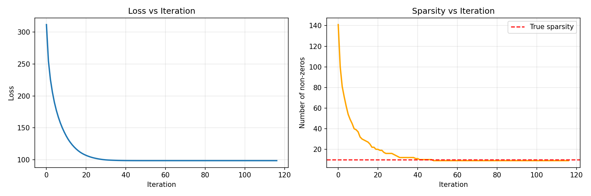

# L1BallPGD

[](https://github.com/marouanedaoudi/L1BallPGD/actions/workflows/ci.yml)
[](https://www.python.org/)
[](https://github.com/astral-sh/ruff)
[](https://mypy-lang.org/)
[](LICENSE)

Projected Gradient Descent (PGD) for constrained sparse regression (constrained Lasso):

$$
\min_{\beta \in \mathbb{R}^p}\ \frac{1}{2}\|y - X\beta\|_2^2
\quad \text{s.t.}\quad \|\beta\|_1 \le t.
$$

This repository provides a minimal PGD solver and an exact Euclidean projection onto the L1 ball.

## Motivation

The objective is smooth convex and the feasible set is closed and convex, so PGD is a natural baseline. The L1-ball constraint promotes sparsity.

## Algorithm

Define the loss function and its gradient:

$$
f(\beta) = \frac{1}{2}\|y - X\beta\|_2^2, \qquad \nabla f(\beta) = X^\top(X\beta - y).
$$

PGD iteration:

$$
\beta^{k+1} = \text{Proj}_{\|\cdot\|_1 \le t}\left(\beta^k - \eta \nabla f(\beta^k)\right).
$$

A standard safe choice is step size $\eta = 1/L$ with $L = \|X\|_2^2$.

## L1-ball projection

Given $v \in \mathbb{R}^p$, the projection solves

$$
\text{Proj}_{\|\cdot\|_1 \le t}(v) = \arg\min_{z \in \mathbb{R}^p}\ \frac{1}{2}\|z - v\|_2^2 \quad \text{s.t.}\quad \|z\|_1 \le t.
$$

If $\|v\|_1 \le t$, the projection is $v$.  
Otherwise the solution has the form

$$
z_i = \text{sign}(v_i) \cdot \max(|v_i| - \theta, 0),
$$

for a threshold $\theta \ge 0$ chosen so that $\|z\|_1 = t$.
The threshold can be found efficiently from the sorted values of $|v_i|$.

## Results

On synthetic data with $n=100$, $p=200$, and true sparsity of 10:



The algorithm converges in ~120 iterations. The loss decreases rapidly and the estimated sparsity converges to the true value.

## Repository layout

```text
src/
  l1_projection.py
  pgd_constrained_lasso.py
  data.py
  metrics.py
scripts/
  run_synth.py
tests/
  test_l1_projection.py
  test_pgd.py
outputs/
  results.png
```

## Installation

```bash
python -m venv .venv
source .venv/bin/activate
pip install -e .          # add ".[dev]" for the test/lint toolchain
```

## How to run

```bash
python scripts/run_synth.py
```

## Development

```bash
pip install -e ".[dev]"
pre-commit install        # optional: run checks on each commit
ruff check .              # lint
ruff format .             # format
mypy                      # type check
pytest                    # tests with coverage
```

## Reference

- John Duchi, Shai Shalev-Shwartz, Yoram Singer, and Tushar Chandra.
  Efficient Projections onto the l1-Ball for Learning in High Dimensions, ICML 2008.
